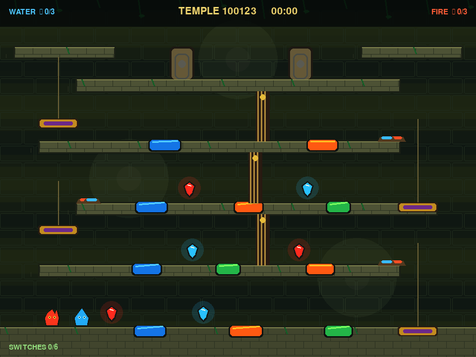

# Fireboy & Watergirl RL

A compact cooperative-control project built with Gymnasium and
Stable-Baselines3. One policy controls Fire and Water across five levels with
character-specific hazards, jumping, raised platforms, and two-door success.

The repository includes keyboard play, headless rendering, human and scripted
demonstrations, behavior cloning, a resumable PPO curriculum, detailed
evaluation, and automated tests.

## Complex temple mode

Launch a newly generated five-floor temple and watch both players solve it
with simultaneous controls:



```bash
python watch_temple.py
```

The temple mode is a separate, backward-compatible environment inspired by
the structure of a full Fireboy & Watergirl level. Each seed changes the
hazards, gem and door positions, and lift timing while preserving a solvable
alternating-floor topology. A level contains:

- four moving lifts and five traversable floors;
- eleven lava, water, and green acid pools;
- three gems for each character;
- six character-specific floor switches;
- three cooperative gates; and
- two locked elemental doors.

One `Discrete(36)` action encodes independent commands for both characters on
the same frame: idle, left, right, jump, left+jump, or right+jump for Fire,
crossed with the same six choices for Water. On the first 100 held-out temple
seeds, the closed-loop expert solves 100/100 and actively moves both players
at once for an average of 472 frames per level. Platforms and lifts are solid
from both directions: characters land on top and bonk their heads underneath.

Play the temple yourself:

```bash
python watch_temple.py --manual
```

Fire uses the arrow keys; Water uses `A`, `W`, and `D`. Train a 250-input,
36-action PPO policy from simultaneous expert demonstrations and randomized
temple rollouts with:

```bash
python train_temple.py
```

Run `python train_temple.py --quick` first to smoke-test the full pipeline.
See the [temple report](reports/TEMPLE.md) and
[`temple_expert_100.json`](reports/temple_expert_100.json) for the exact
mechanics and benchmark.

## Solve a brand-new level

Generate a level from a fresh random seed, plan from its geometry, and watch
both players beat it:

```bash
python watch_unseen.py
```

Replay a particular unseen layout:

```bash
python watch_unseen.py --seed 100123
```

Both commands above work on a fresh clone, because the planner solves the
layout without a trained model. Once you have trained a generalist checkpoint,
you can watch the geometry-only policy with its wrong-pool safety shield
instead:

```bash
python watch_unseen.py \
  --seed 100123 \
  --model checkpoints/firewater_generalist_best
```

The generalized controller receives player state and visible geometry but no
level ID. The trainer restricts new runs to seeds below `100000`; evaluation
uses held-out seeds beginning at `100000`. On 1,000 held-out layouts, the pure
neural policy solves 96.1%, while the policy plus its geometry safety shield
and the independent planner each solve 100%.

See the [generalization report](reports/GENERALIZATION.md) and raw evaluation
files for the exact protocol and an important scope boundary: this currently
generalizes across newly generated layouts within this simulator's mechanics,
not arbitrary screenshots from the commercial Fireboy & Watergirl game.

## Setup

Python 3.10 or newer is recommended.

```bash
python3 -m venv .venv
source .venv/bin/activate
python -m pip install -r requirements.txt
```

### Trained checkpoints are not included

Stable-Baselines3 checkpoints are deliberately excluded from Git, so a fresh
clone contains no `.zip` models. Everything that does not need a trained
policy runs immediately: keyboard play, random and scripted rollouts, the
planner, the temple expert, `watch_unseen.py`, `watch_temple.py`, and the full
test suite. Commands below that name a path under `checkpoints/` expect a
model you trained yourself with `train_ppo.py`, `train_generalist.py`, or
`train_temple.py`. The JSON files in [`reports/`](reports) record the results
those checkpoints produced.

## Play and inspect the environment

Play both characters yourself:

```bash
python play_human.py --level 0
```

Fire uses the arrow keys. Water uses `A`, `D`, and `W`. Press `N`/`P` to
change levels, `R` to reset, and `Esc` or `Q` to quit.

Run a random-policy visual smoke test:

```bash
python visual_rollout.py --level 2 --steps 300
```

Watch a trained checkpoint:

```bash
python rollout_trained.py --level 4
```

Playback automatically prefers the overnight `firewater_refined_final`
checkpoint, then a standard full-training checkpoint, when one is present.
Stable-Baselines3 checkpoints are intentionally ignored by Git; train one or
pass another path with `--model` when no local default exists.

## Evaluate checkpoints

The evaluator reports success, hazard, timeout, return, and episode length for
each level. It can compare multiple checkpoints and save machine-readable JSON.

```bash
python evaluate_agent.py \
  ppo_firewater \
  ppo_firewater_level0_strong \
  ppo_firewater_multi \
  --episodes 10 \
  --output reports/evaluation.json
```

The checked-in [baseline report](reports/baseline.json) captures the models
that were present when the training overhaul began. It shows that the old
`ppo_firewater_multi` checkpoint succeeds on level 0 but not levels 1–4.
The [overnight benchmark](reports/OVERNIGHT.md) records the complete progression
and links the raw deterministic and stochastic evaluation reports.

## Demonstrations

Record a keyboard trajectory:

```bash
python record_demo.py --level 0 --output demo_level0_run1.npz
```

New recordings use the 56-value enhanced state. The trainer can also replay
older 19-value recordings into that state when their level is stored in the
file or included in a `level<N>` filename.

Generate deterministic successful trajectories for every level:

```bash
python scripted_demos.py
```

Scripted demonstrations are generated in memory by the trainer by default, so
a fresh checkout can use behavior cloning even when no local `.npz` recordings
exist. Generated files contain observations, actions, rewards, level metadata,
terminal reason, and a format version.

## Train

First verify the complete behavior-cloning, curriculum, evaluation, and
checkpoint pipeline with a small smoke run:

```bash
python train_ppo.py --quick
```

Start the full five-level curriculum:

```bash
python train_ppo.py
```

New training uses the enhanced observation by default. It includes goal
heights, completion flags, level identity, padded platform geometry, and full
hazard boundaries so the policy can distinguish raised-door layouts and time
jumps at pool edges. Existing 19- and 48-input checkpoints remain compatible
with playback and evaluation; use the matching `--observation-mode` only when
resuming one.

The full preset trains these phases:

1. Level 0 fundamentals
2. Level 1 adaptation
3. Level 2 raised doors
4. Levels 0–2 consolidation
5. Levels 0–4 exploration, including the harder platform levels
6. Extra level 3–4 refinement while replaying levels 0–2
7. Final all-level consolidation

Checkpoints and per-phase JSON evaluations are written under `checkpoints/`.
Monitor logs go to `logs/`, and TensorBoard events go to `tb_firewater/`.

Resume at a phase boundary:

```bash
python train_ppo.py \
  --resume checkpoints/firewater_ppo_phase3_level2.zip \
  --start-phase 4
```

Useful controls include `--timesteps-scale`, `--n-envs`, `--n-steps`,
`--batch-size`, `--bc-epochs`, `--save-every`, `--seed`, `--device`,
`--ent-coef`, and `--no-scripted-demos`. By default the curriculum decays
entropy during each newly introduced challenge, then tapers it through hard-map
refinement and deterministic all-level consolidation. Run
`python train_ppo.py --help` for the full interface.

To inspect training:

```bash
tensorboard --logdir tb_firewater
```

Train the geometry-only policy on a fresh randomized layout after every reset:

```bash
python train_generalist.py
```

Evaluate the planner, raw policy, and safety-shielded policy on disjoint
levels. The first command needs no checkpoint; the other two evaluate a
generalist model you trained:

```bash
python evaluate_generalist.py --planner --count 1000
python evaluate_generalist.py checkpoints/firewater_generalist_best --count 1000
python evaluate_generalist.py checkpoints/firewater_generalist_best \
  --count 1000 --safety-shield
```

## Test

```bash
python -m unittest discover -s tests -v
```

The suite covers Gymnasium compliance, all five level solutions, terminal
conditions, cooperative reward shaping, headless RGB rendering, demonstration
validation, curriculum scaling, procedural determinism, disjoint seed splits,
unseen-level planning, the safety shield, and evaluation metrics. CI also
performs small end-to-end fixed and procedural training runs.

## Project layout

- `firewater_env.py`: environment, physics, rewards, rendering, and recorder
- `scripted_demos.py`: successful source-controlled expert trajectories
- `procedural_levels.py`: deterministic full-level generation and seed splits
- `generalized_planner.py`: geometry-driven weighted-A* expert
- `safety_shield.py`: level-agnostic wrong-pool prevention
- `train_generalist.py`: planner cloning plus procedural PPO domain randomization
- `evaluate_generalist.py`: held-out layout benchmarking
- `watch_unseen.py`: generate and visibly solve a brand-new level
- `temple_levels.py`: seeded multi-floor temple topology and puzzle objects
- `temple_env.py`: joint actions, lifts, gems, switches, gates, and rendering
- `temple_expert.py`: closed-loop simultaneous temple controller and benchmark
- `watch_temple.py`: automatic or keyboard-controlled complex temple playback
- `train_temple.py`: expert cloning plus randomized temple PPO training
- `train_ppo.py`: validated BC plus configurable/resumable PPO curriculum
- `evaluation.py`: reusable per-level evaluation metrics
- `evaluate_agent.py`: checkpoint comparison CLI and JSON reporting
- `play_human.py`: simultaneous keyboard controls
- `visual_rollout.py`: random-policy visual smoke test
- `rollout_trained.py`: trained PPO playback
- `tests/`: environment, demonstration, training, and evaluation regressions

## License and attribution

Released under the [MIT License](LICENSE).

This is an independent, from-scratch project written for research and
education. It is inspired by the structure of the Fireboy & Watergirl games
but is not affiliated with, endorsed by, or derived from them, and contains no
code or assets from the originals. "Fireboy & Watergirl" belongs to its
respective rights holders.
