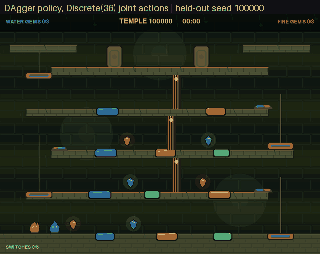
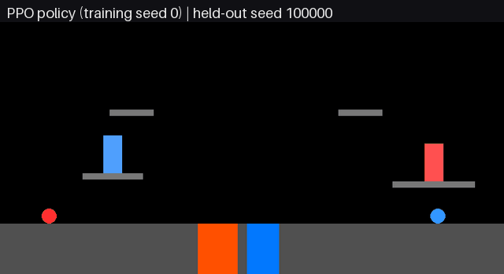

# Fireboy & Watergirl RL

[](https://github.com/AyushG225/FireboyWatergirlRL/actions/workflows/ci.yml)

Neural policies, a planner, and a scripted expert that control both characters
of a Fireboy and Watergirl style cooperative platformer, measured on 1,000
procedurally generated levels held out from training and checkpoint selection.

<table>
  <tr>
    <td width="50%"></td>
    <td width="50%"></td>
  </tr>
  <tr>
    <td>Temple: one <code>Discrete(36)</code> action moves both characters on every frame. Trained policy (cloning + DAgger) on held-out seed 100000, played at 3x speed.</td>
    <td>Procedural levels: cloning + PPO policy (training seed 0) on held-out seeds 100000 and 100001, played in real time.</td>
  </tr>
</table>

## Results

Every row is measured once on test layouts 100000 to 100999. Training used
seeds below 90000, and each learned checkpoint was chosen on validation
layouts from 90000 to 99999.

| Environment | Controller | Type | Success | Source |
| --- | --- | --- | ---: | --- |
| Temple, `Discrete(36)` joint actions | Weighted cloning + DAgger | neural policy | **99.1%** | [temple_imitation_1000.json](reports/temple_imitation_1000.json) |
| Temple | Closed-loop geometry expert | scripted expert | 100.0% | [temple_expert_1000.json](reports/temple_expert_1000.json) |
| Procedural levels, `Discrete(7)` | Cloning + PPO, mean of 3 training seeds | neural policy | **97.3%** | [generalist_ablation_1000.json](reports/generalist_ablation_1000.json) |
| Procedural levels | Cloning + PPO + safety shield | neural policy + shield | 95.3% | [generalist_ablation_1000.json](reports/generalist_ablation_1000.json) |
| Procedural levels | Weighted A* planner | planner | 100.0% | [generalist_ablation_1000.json](reports/generalist_ablation_1000.json) |

Ablations on the same test layouts: cloning alone solves 0.1% of procedural
levels and 0.0% of temples, and PPO without cloning solves 0.0% of procedural
levels. Per-difficulty tables, shield analysis, and protocol details are in the
[generalization report](reports/GENERALIZATION.md) and the
[temple report](reports/TEMPLE.md).

**How it works.** A weighted A* planner (procedural levels) and a scripted
expert (temple) produce demonstrations, and behavior cloning copies them into a
neural policy. On procedural levels, PPO then fine-tunes that policy. In the
temple, DAgger runs the learner, has the expert label the states it reaches,
and retrains. A geometry safety shield can override a step toward a lethal
pool. PPO fine-tuning of the temple policy dropped validation success to 0%,
so the temple policy is trained by imitation alone.

**Engineering.**

- 56 unit tests. CI runs ruff lint and format checks, the tests, and
  short end-to-end runs of all three trainers.
- Throughput on an Apple M4 Pro, random actions: 4,525 steps/s for one
  temple environment and 18,508 steps/s across 8 subprocess
  environments; 55,009 steps/s for one procedural-level environment
  ([throughput.json](reports/throughput.json)).
- Checkpoints for every learned row are attached to the
  [v1.0.0 release](https://github.com/AyushG225/FireboyWatergirlRL/releases/tag/v1.0.0).

## Quick start

Python 3.10 or newer.

```bash
python3 -m venv .venv
source .venv/bin/activate
python -m pip install -r requirements.txt
python scripts/watch_temple.py
```

That last command generates a new temple and lets the scripted expert solve it.
Watch the trained policy instead after downloading the release checkpoints:

```bash
gh release download v1.0.0 --repo AyushG225/FireboyWatergirlRL --dir checkpoints/release
python scripts/watch_temple.py --model checkpoints/release/temple_dagger_egocentric.zip
```

### Trained checkpoints

Checkpoints are excluded from Git and published as release assets. Everything
that needs no trained policy runs from a fresh clone: keyboard play, random
and scripted rollouts, the planner, the temple expert, and the tests.

| Release asset | Result it reproduces |
| --- | --- |
| `temple_dagger_egocentric.zip` | temple policy, 99.1% |
| `temple_dagger_absolute.zip`, `temple_bc_only.zip`, `temple_dagger_ppo.zip` | temple ablation rows |
| `generalist_bc_ppo_seed{0,1,2}.zip` | procedural policy, 97.3% mean |
| `generalist_bc_only_seed{0,1,2}.zip`, `generalist_ppo_only_seed{0,1,2}.zip` | procedural ablation rows |

`SHA256SUMS.txt` in the release lists a checksum for each file.

## Temple mode

```bash
python scripts/watch_temple.py            # scripted expert on a fresh temple
python scripts/watch_temple.py --manual   # play both characters yourself
```

Fire uses the arrow keys; Water uses `A`, `W`, and `D`. Each seed changes the
hazards, gem and door positions, and lift timing while preserving a solvable
alternating-floor topology. A level contains:

- four moving lifts and five traversable floors;
- eleven lava, water, and green acid pools;
- three gems for each character;
- six character-specific floor switches;
- three cooperative gates; and
- two locked elemental doors.

One `Discrete(36)` action encodes independent commands for both characters on
the same frame: idle, left, right, jump, left+jump, or right+jump for Fire,
crossed with the same six choices for Water. Platforms and lifts are solid from
both directions: characters land on top and bonk their heads underneath.

Train the temple policy with cloning plus 16 DAgger rounds and no PPO:

```bash
python scripts/train_temple.py --timesteps 0 --dagger-iterations 16
```

The trainer scores every stage on validation layouts and writes its choice to
`selected_checkpoint` in `checkpoints/firewater_temple_validation.json`. Score
that checkpoint on the test layouts with
`python scripts/evaluate_temple.py checkpoints/<selected_checkpoint>.zip`, or
pass it to `--init-model` to fine-tune it with PPO. Run `python scripts/train_temple.py --quick` to check the
whole pipeline in a few seconds. The [temple report](reports/TEMPLE.md) covers
the mechanics, the training pipeline, and the ablations.

## Procedural levels

Generate a level from a fresh random seed, plan from its geometry, and watch
both players beat it:

```bash
python scripts/watch_unseen.py
python scripts/watch_unseen.py --seed 100123
```

Both commands work on a fresh clone because the planner needs no trained model.
With the release checkpoints you can watch the learned policy, optionally with
the safety shield:

```bash
python scripts/watch_unseen.py --seed 100123 \
  --model checkpoints/release/generalist_bc_ppo_seed0.zip
python scripts/watch_unseen.py --seed 100123 --safety-shield \
  --model checkpoints/release/generalist_bc_ppo_seed0.zip
```

The procedural controller receives player state and visible geometry, with no
level ID. The results cover newly generated layouts within this simulator's
mechanics. Levels from the commercial Fireboy and Watergirl game use sprites,
switches, and physics that the simulator does not model.

## Play and inspect the environment

Play both characters yourself:

```bash
python scripts/play_human.py --level 0
```

Fire uses the arrow keys. Water uses `A`, `D`, and `W`. Press `N`/`P` to
change levels, `R` to reset, and `Esc` or `Q` to quit.

Run a random-policy visual smoke test:

```bash
python scripts/visual_rollout.py --level 2 --steps 300
```

Watch a trained checkpoint:

```bash
python scripts/rollout_trained.py --level 4
```

Playback automatically prefers the overnight `firewater_refined_final`
checkpoint, then a standard full-training checkpoint, when one is present.
Stable-Baselines3 checkpoints are intentionally ignored by Git; train one or
pass another path with `--model` when no local default exists.

## Evaluate checkpoints

The evaluator reports success, hazard, timeout, return, and episode length for
each level. It can compare multiple checkpoints and save machine-readable JSON.

```bash
python scripts/evaluate_agent.py \
  ppo_firewater \
  ppo_firewater_level0_strong \
  ppo_firewater_multi \
  --episodes 10 \
  --output reports/evaluation.json
```

The checked-in [baseline report](reports/baseline.json) captures the models
that were present when the training overhaul began. It shows that the old
`ppo_firewater_multi` checkpoint succeeds on level 0 and fails levels 1 to 4.
The [overnight benchmark](reports/OVERNIGHT.md) records the complete progression
and links the raw deterministic and stochastic evaluation reports.

## Demonstrations

Record a keyboard trajectory:

```bash
python scripts/record_demo.py --level 0 --output demo_level0_run1.npz
```

New recordings use the 56-value enhanced state. The trainer can also replay
older 19-value recordings into that state when their level is stored in the
file or included in a `level<N>` filename.

Generate deterministic successful trajectories for every level:

```bash
python scripts/scripted_demos.py
```

Scripted demonstrations are generated in memory by the trainer by default, so
a fresh checkout can use behavior cloning even when no local `.npz` recordings
exist. Generated files contain observations, actions, rewards, level metadata,
terminal reason, and a format version.

## Train

First verify the complete behavior-cloning, curriculum, evaluation, and
checkpoint pipeline with a small smoke run:

```bash
python scripts/train_ppo.py --quick
```

Start the full five-level curriculum:

```bash
python scripts/train_ppo.py
```

New training uses the enhanced observation by default. It includes goal
heights, completion flags, level identity, padded platform geometry, and full
hazard boundaries so the policy can distinguish raised-door layouts and time
jumps at pool edges. Existing 19- and 48-input checkpoints remain compatible
with playback and evaluation; use the matching `--observation-mode` only when
resuming one.

The full preset trains these phases:

1. Level 0 fundamentals
2. Level 1 adaptation
3. Level 2 raised doors
4. Levels 0 to 2 consolidation
5. Levels 0 to 4 exploration, including the harder platform levels
6. Extra refinement on levels 3 and 4 while replaying levels 0 to 2
7. Final all-level consolidation

Checkpoints and per-phase JSON evaluations are written under `checkpoints/`.
Monitor logs go to `logs/`, and TensorBoard events go to `tb_firewater/`.

Resume at a phase boundary:

```bash
python scripts/train_ppo.py \
  --resume checkpoints/firewater_ppo_phase3_level2.zip \
  --start-phase 4
```

Useful controls include `--timesteps-scale`, `--n-envs`, `--n-steps`,
`--batch-size`, `--bc-epochs`, `--save-every`, `--seed`, `--device`,
`--ent-coef`, and `--no-scripted-demos`. By default the curriculum decays
entropy during each newly introduced challenge, then tapers it through hard-map
refinement and deterministic all-level consolidation. Run
`python scripts/train_ppo.py --help` for the full interface.

To inspect training:

```bash
tensorboard --logdir tb_firewater
```

Train the geometry-only policy with a fresh randomized layout after every
reset. Checkpoints are scored on validation layouts every 250,000 steps and the
choice is written to `checkpoints/<run-name>_validation.json`:

```bash
python scripts/train_generalist.py --seed 0 --run-name gen_bc_s0
python scripts/train_generalist.py --seed 0 --no-bc --run-name gen_nobc_s0
```

Score a checkpoint on the 1,000 test layouts, with and without the shield, and
the planner:

```bash
python scripts/evaluate_generalist.py checkpoints/release/generalist_bc_ppo_seed0.zip --count 1000
python scripts/evaluate_generalist.py checkpoints/release/generalist_bc_ppo_seed0.zip \
  --count 1000 --safety-shield
python scripts/evaluate_generalist.py --planner --count 1000
```

`scripts/generalist_ablation.py` scores every run in a directory at once and
writes the ablation table.

## Test

```bash
python -m pip install -r requirements-dev.txt
ruff check firewater scripts tests
ruff format --check firewater scripts tests
python -m unittest discover -s tests -v
```

The suite covers Gymnasium compliance, all five fixed-level solutions,
terminal conditions, reward shaping, headless rendering, demonstration
validation, curriculum scaling, procedural determinism, disjoint seed splits,
unseen-level planning, the safety shield, both temple observation modes, the
stateless expert, weighted cloning, and a regression test for subprocess
environments. A docs test checks README and report prose and links.

Measure environment throughput:

```bash
python scripts/benchmark_throughput.py --n-envs 4 8 12 --output reports/throughput.json
```

Render the README animations headless:

```bash
python scripts/render_gif.py temple-policy --label "DAgger policy" --every 3 \
  --model checkpoints/release/temple_dagger_egocentric.zip --seeds 100000 \
  --width 640 --output docs/media/temple_policy.gif
```

## Project layout

`firewater/` is the importable library and `scripts/` holds every runnable
command. Scripts add the repository root to `sys.path` themselves, so a fresh
clone runs without an install step.

```
firewater/          library
├── firewater_env.py        fixed and procedural levels: physics, rewards, rendering
├── procedural_levels.py    deterministic level generation and seed splits
├── temple_env.py           joint actions, lifts, gems, switches, gates, observations
├── temple_levels.py        seeded multi-floor temple topology
├── temple_evaluation.py    batched temple rollouts and metrics
├── scripted_demos.py       successful source-controlled expert trajectories
├── generalized_planner.py  geometry-driven weighted A* expert
├── temple_expert.py        closed-loop temple controller, stateful or stateless
├── safety_shield.py        level-agnostic wrong-pool override
├── evaluation.py           per-level evaluation metrics
├── generalization.py       held-out procedural metrics with per-difficulty counts
├── train_ppo.py            weighted cloning plus resumable PPO curriculum
└── rollout_trained.py      trained PPO playback

scripts/            commands
├── watch_temple.py         expert, policy, or keyboard temple playback
├── watch_unseen.py         generate and visibly solve a brand-new level
├── play_human.py           simultaneous keyboard controls
├── visual_rollout.py       random-policy visual smoke test
├── rollout_trained.py      trained checkpoint playback
├── record_demo.py          record a keyboard trajectory
├── scripted_demos.py       write deterministic demonstrations to disk
├── generalized_planner.py  plan and verify a route through one layout
├── temple_expert.py        benchmark the temple expert
├── temple_expert_stats.py  stateless expert check and demonstration statistics
├── train_ppo.py            five-level curriculum
├── train_generalist.py     planner cloning plus procedural PPO
├── train_temple.py         weighted cloning, DAgger, and PPO for the temple
├── evaluate_agent.py       checkpoint comparison and JSON reporting
├── evaluate_generalist.py  procedural test-layout benchmarking
├── evaluate_temple.py      temple test-layout benchmarking
├── generalist_ablation.py  score every generalist run on the test layouts
├── shield_diagnosis.py     paired shield comparison on validation layouts
├── benchmark_throughput.py environment steps per second
└── render_gif.py           headless captioned GIFs

tests/              unit, regression, and docs tests
reports/            reports and raw evaluation JSON; superseded files in archive/
docs/media/         README animations
```

## License and attribution

Released under the [MIT License](LICENSE).

This is an independent, from-scratch project written for research and
education and is inspired by the structure of the Fireboy & Watergirl games.
It is not affiliated with, endorsed by, or derived from them, and contains no
code or assets from the originals. "Fireboy & Watergirl" belongs to its
respective rights holders.
